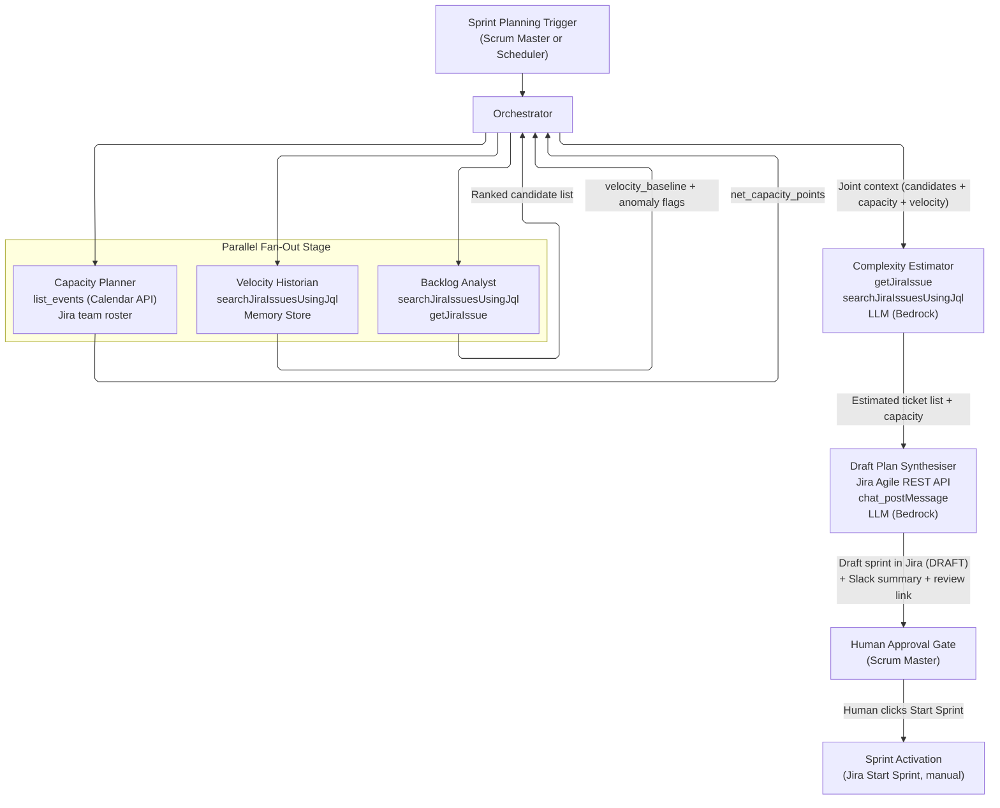

# Project 2: Intelligent Sprint Planning Agent (Reference Architecture)

---

## 1. Overview

### Problem Being Solved

Engineering teams spend 2 to 4 hours per sprint in planning meetings, manually reconciling backlog priority, team availability, historical velocity, and ticket complexity. The outcome depends heavily on the scrum master's experience and institutional knowledge, is inconsistently applied across teams, and frequently results in over-commitment (15 to 25 percent rollover is common) or under-utilisation. New scrum masters take several sprints to reach planning confidence.

### Business Value

- Reduces sprint planning ceremony time from hours to minutes of human review
- Delivers consistent, data-driven sprint recommendations that improve over time
- Cuts rollover rate by anchoring commitments to empirical velocity and realistic capacity
- Accelerates onboarding of new scrum masters by encoding planning heuristics in the agent
- Creates an auditable record of every planning decision and its rationale

### The One-Line Question the Agent Answers

> **Given our backlog, team capacity, and historical velocity, what should be in our next sprint, and why?**

---

## 2. Agent Map

| Agent Name | Single Responsibility | Tools It Uses |
|---|---|---|
| **Orchestrator** | Receives the sprint planning trigger, coordinates the fan-out and convergence stages, manages shared context, and delivers the final plan to the human approver | Internal state store; invokes all sub-agents |
| **Backlog Analyst** | Queries the full product backlog, scores each ticket by priority, dependency status, and staleness, and returns a ranked candidate list | `searchJiraIssuesUsingJql`, `getJiraIssue` (Atlassian Jira MCP) |
| **Capacity Planner** | Reads team member availability from the calendar API, applies any PTO, holidays, or part-time flags, and computes net sprint capacity in story points | `list_events` (Google Calendar API); team roster lookup via Jira (see Tools section) |
| **Velocity Historian** | Fetches the last 5 to 8 completed sprints, computes a rolling velocity baseline, and flags anomalous sprints (e.g., disrupted by a production incident) to exclude them | `searchJiraIssuesUsingJql` (Atlassian Jira MCP); short-term memory store |
| **Complexity Estimator** | For each unestimated ticket in the candidate list, reasons over description, acceptance criteria, and few-shot examples from the team's own history to suggest a story point range | LLM (Amazon Bedrock); `getJiraIssue`, `searchJiraIssuesUsingJql` (Atlassian Jira MCP) for few-shot retrieval |
| **Draft Plan Synthesiser** | Selects tickets up to net capacity in priority order, avoids blocked or orphaned tickets, annotates each selection with reasoning, flags risks, iterates if the plan exceeds capacity, writes the draft sprint to Jira (not yet activated), and sends a Slack summary | Jira Software (Agile) REST API for sprint create and issue assignment; `chat_postMessage` (Slack API); LLM for reasoning |

---

## 3. Tools & Integrations

| Tool / System | Purpose | Notes |
|---|---|---|
| **`searchJiraIssuesUsingJql`** (Atlassian Jira MCP) | Run JQL queries to retrieve backlog tickets, historical sprint issues, and comparable estimated tickets for few-shot examples | Returns priority, status, story points, labels, and links. Used by the Backlog Analyst for the candidate pool, the Velocity Historian for sprint history, and the Complexity Estimator for similar-ticket lookup. |
| **`getJiraIssue`** (Atlassian Jira MCP) | Fetch full detail (description, acceptance criteria, story points, comments, issue links) for a single ticket | The Backlog Analyst uses link data to exclude blocked or orphaned tickets. The Complexity Estimator uses the full detail as reasoning input. |
| **Jira Software (Agile) REST API** | Create a DRAFT sprint with a name, goal, and date range, and assign selected issues to it | The Atlassian Jira MCP server does not expose sprint create or sprint-membership operations, so the Synthesiser calls the Jira Software (Agile) REST API directly. The sprint is created in DRAFT state and is not started. Assigning an issue already in the sprint is a no-op, so the call is idempotent. A team roster for the project board is also read from Jira (Agile board or project-member API) before the Capacity Planner queries calendars. |
| **`list_events`** (Google Calendar API) | Fetch calendar events for each team member over the sprint window to identify PTO, holidays, and focus-time blocks | The Capacity Planner maps event durations to story point deductions using a configurable formula. A Google Workspace service account with domain-wide delegation and read-only calendar scope is required. Credentials are stored in AWS Secrets Manager. |
| **LLM (Amazon Bedrock)** | Reasoning over ticket descriptions and acceptance criteria for complexity estimation, and synthesis of the sprint plan narrative and risk annotations | Amazon Bedrock provides managed, private inference: prompts are not used for model training, and inference runs within AWS's managed infrastructure. Use the `claude-sonnet-4-6` model (the same Bedrock model used in Sessions 2, 3, 5, and 6). No separate private hosting is required. |
| **`chat_postMessage`** (Slack API) | Post a structured sprint plan summary to the team channel, with a deep-link to the draft Jira sprint | The Synthesiser uses this after the Jira write-back. The message includes sprint name, committed points, capacity, a 3-sprint velocity trend, and a table of the top tickets with estimated points and one-line reasoning. |
| **Short-term memory store** | The Velocity Historian stores sprint-level metadata (velocity, anomaly flags, sprint ID) across the planning session, avoiding re-querying and passing context to the Complexity Estimator | An in-process key-value store or a lightweight Redis instance, scoped to the current planning run. |

---

## 4. Orchestration Pattern

### Pattern Name: Parallel Fan-Out then Converge (Hierarchical Multi-Agent)

### Rationale

Sprint planning has three independent data-gathering concerns: what exists in the backlog, how much capacity the team has, and what velocity the team has historically delivered. These concerns share no data dependencies, so they can run simultaneously. Running them in parallel cuts wall-clock time substantially compared to a sequential pipeline.

Once all three data streams are available, they converge before further reasoning begins. The Complexity Estimator needs the candidate pool (from the Backlog Analyst) and historical ticket examples (from the Velocity Historian). The Synthesiser needs the estimated tickets and a capacity figure. Information gathering is parallel; synthesis is sequential.

### Stages

**Stage 1: Parallel Fan-Out (simultaneous)**

- **Backlog Analyst** queries the full backlog, scores and ranks candidates, and identifies blocked/orphaned tickets to exclude.
- **Capacity Planner** reads team member calendars over the sprint window, applies availability deductions, and emits a net capacity figure in story points.
- **Velocity Historian** fetches the last 5 to 8 completed sprints, computes a rolling average, flags anomalous sprints, and stores the baseline in the short-term memory store.

**Stage 2: Converge into Complexity Estimator**

All three outputs are joined by the Orchestrator and passed to the **Complexity Estimator**, which processes the unestimated tickets from the candidate list using few-shot examples drawn from the team's own history.

**Stage 3: Draft Plan Synthesiser**

The **Draft Plan Synthesiser** receives the fully estimated, ranked candidate list plus the net capacity figure. It uses a greedy selection pass: it iterates through the ranked list, skips blocked tickets, and skips any ticket that would push the running total above `net_capacity_points`, then continues to the next candidate. The plan is within capacity after a single pass, with no correction loop needed. It annotates each selected ticket with reasoning and risk flags.

**Stage 4: Human-in-the-Loop Delivery**

The Synthesiser writes the draft sprint to Jira (DRAFT state, not activated) and posts a summary to Slack with a review link. After sending the notification, the Orchestrator sets `sprint_status = PENDING_APPROVAL` in the state store. The workflow is then complete. Sprint activation happens out-of-band: the Scrum Master clicks Jira's native "Start Sprint" button. The agent does not await a callback or poll for approval. This is intentional: the agent has no write access to trigger sprint activation, enforcing the human-in-the-loop constraint at the infrastructure level.

---

## 5. Data & Control Flow

### Trigger

A sprint planning request is initiated either by a scheduled cron (e.g., two days before sprint end) or manually by the Scrum Master via a Slack command or Jira automation webhook. The Orchestrator receives a payload containing the project key, the planned sprint window, an optional sprint goal, and the team identifier. At trigger time, it generates a `planning_run_id` (UUID v4) used throughout the run for idempotency and traceability.

### Stage 1: Parallel Fan-Out

The Orchestrator dispatches three concurrent sub-tasks.

**Backlog Analyst path:** The agent calls `searchJiraIssuesUsingJql` with a filter scoped to the project board (e.g., status in Backlog or Ready, excluding tickets already in an active sprint). For each candidate it calls `getJiraIssue` to inspect issue links and check for unresolved blockers. It assigns a composite score combining priority weight, staleness penalty, and a dependency-clear bonus. The output is a ranked candidate list plus a separate exclusion list of blocked or orphaned tickets.

**Capacity Planner path:** The agent reads the team roster from Jira, then calls `list_events` on each member's calendar for the sprint window. It maps full-day out-of-office events to a full-day deduction, half-day events to a half-day deduction, and applies a configurable focus-time multiplier to account for meeting overhead. It sums available capacity across the team and emits a single `net_capacity_points` value.

**Velocity Historian path:** The agent calls `searchJiraIssuesUsingJql` to retrieve issues from the last 8 completed sprints and computes each sprint's completion ratio (completed points / committed points). Sprints below 0.5 are flagged `"low_velocity"` and **excluded** from the baseline, as these are likely disrupted sprints. Sprints above 1.3 are flagged `"over_delivery"` but **retained**, with their contribution capped relative to the running average. Capping rather than excluding preserves the signal: consistent over-delivery often reflects systematic underestimation, which is useful data. Both anomaly categories are surfaced in the Slack notification. The `velocity_baseline` is computed from all retained sprints.

### Stage 2: Convergence into Complexity Estimator

The Orchestrator waits for all three parallel tasks to complete (or times out after 90 seconds and proceeds with available data, flagging any missing input). It assembles the joint context: the ranked candidate list, the net capacity, the velocity baseline, and the anomaly-flagged sprints.

The Complexity Estimator filters the candidate list to unestimated tickets. For each, it calls `getJiraIssue` to retrieve the description and acceptance criteria, then calls `searchJiraIssuesUsingJql` to find recently estimated tickets of the same component and type for few-shot examples. Examples with extreme story points are excluded as outliers. If too few matches are found, the query falls back to recent estimated tickets of the same type across all components. The agent constructs a few-shot prompt (system prompt, historical examples with their actual story points, and the target ticket) and the LLM returns a story point range with a confidence level and a one-sentence rationale. The agent assigns the midpoint as the working estimate and tags the ticket `ai_estimated` for human visibility.

### Stage 3: Draft Plan Synthesiser

The Synthesiser receives the fully estimated, ranked candidate list and the net capacity figure. It uses a **greedy selection pass**: iterating in priority order while maintaining a running total of committed points. A ticket on the exclusion list (blocked, orphaned, or a dependency of a blocked ticket) is skipped with a recorded reason. A ticket that would exceed `net_capacity_points` is also skipped, but the algorithm **continues to the next ticket** rather than stopping. This lets smaller lower-priority tickets fill remaining capacity without ever exceeding it. The plan is within capacity after a single pass, so no correction loop is needed.

Escalation is reserved for the rare case where the entire ranked list is exhausted without any feasible ticket (typically when all high-priority tickets are large and no smaller tickets exist). The Synthesiser then offers the Scrum Master three options:
1. **Accept over-commitment:** Approve the highest-priority ticket even though it exceeds capacity.
2. **Split the largest ticket:** Suggest a breakdown of the single largest ticket into two sub-tasks.
3. **Extend the sprint:** Adjust sprint dates to accommodate the scope.

When escalating, the Synthesiser writes the as-is plan (Option 1) to Jira as a DRAFT sprint flagged with label `PLANNING_ESCALATION`, and the Slack message links to it.

For each selected ticket, the Synthesiser writes a brief annotation: priority reason, estimation source (human or AI), and any risk flags (single-engineer dependency, low-confidence AI estimate, large ticket without subtasks). Annotations are generated in batches with few-shot context to stay within LLM context limits at scale, and accumulated in the state store between batches.

The Synthesiser then creates a DRAFT sprint via the Jira Software (Agile) REST API and assigns the selected tickets. **For idempotency**, before creating a sprint it checks the state store for an existing `sprint_id` under the key `sprint-plan-run:{planning_run_id}`. If found, it skips creation and assigns issues to the existing draft sprint instead. The sprint name follows the convention `Sprint {N} [run:{planning_run_id}]` as a human-readable marker. Issue assignment is naturally idempotent: adding an issue already in the sprint is a no-op. The state store is the authoritative idempotency record.

It then posts a structured Slack message via `chat_postMessage` containing sprint name, committed points, capacity, a 3-sprint velocity trend, and a table of the top tickets with estimated points and one-line reasoning. The message includes a passive review link to the draft Jira sprint.

**Trust-building mode:** During initial rollout, the Synthesiser can be configured to skip the Jira write-back and instead include a **"Create Draft in Jira"** interactive button in the Slack message. Clicking it (restricted to the `scrum-masters` Slack user group) triggers the sprint creation and issue assignment. This lets the team review several planning cycles in read-only mode before enabling automatic writes (see Key Behavior #5). Once trust is established, the auto-write flow becomes the default.

Human edits to the Jira draft sprint do NOT trigger re-processing; the agent run is stateless after delivery. A new run can be triggered manually (e.g., a `/sprint-plan` Slack command), which re-reads the current draft state.

### Stage 4: Human Approval and Sprint Activation

After posting the Slack notification, the Orchestrator sets `sprint_status = PENDING_APPROVAL` in the state store and the workflow is complete. The draft sprint sits in Jira in DRAFT state. The Scrum Master reviews it, optionally removes or swaps tickets, and clicks Jira's native "Start Sprint" button to activate the sprint. The agent never activates sprints and does not await a callback. This is intentional: the agent has no write access to trigger activation, enforcing the human-in-the-loop constraint at the infrastructure level. A separate post-sprint observer agent (triggered by a Jira sprint-close webhook) compares committed vs. completed points to update the velocity baseline and track planning accuracy. It is specified in NFR 4 and runs outside the planning pipeline.

---

## 6. Diagrams

### 6.1 Agent Map Diagram

---

## 7. Key Agentic Behaviors

1. **Multi-step reasoning for complexity estimation.** The Complexity Estimator does not apply keyword rules or lookup tables. It builds a few-shot prompt from recently estimated tickets of the same component and type (with extreme story-point outliers excluded), falling back to recent tickets of the same type across all components when too few matches exist. Each example carries its description, acceptance criteria, and the actual story points the team assigned. The LLM reasons step by step: identifying the scope implied by the acceptance criteria, comparing it to the historical examples, and arriving at a story point range with a confidence level and a written rationale. Estimation improves over time as the team's history grows, and novel ticket types are handled by reasoning rather than failing silently.

2. **Memory of past sprints via the Velocity Historian.** The Velocity Historian does not blindly average all historical sprints. During the planning run it tags each sprint by completion-ratio band: a ratio below 0.50 is `"low_velocity"` and excluded from the baseline (a likely disrupted sprint), and a ratio above 1.30 is `"over_delivery"`, flagged for review but retained with a capped contribution. Capping rather than excluding over-delivery sprints preserves the signal: a team that consistently delivers above its commitment is likely underestimating story points, which is valid data. Excluding these would produce an artificially conservative baseline and chronic under-commitment. All anomaly flags are surfaced in the Synthesiser's risk annotations to inform the Scrum Master.

3. **Greedy selection with single-pass convergence.** The Synthesiser's greedy algorithm produces a within-capacity plan in a single pass, with no correction loop. Iterating in priority order, it skips any blocked or orphaned ticket, and skips (rather than later removes) any ticket that would push the total above `net_capacity_points`, continuing the pass so smaller lower-priority tickets can fill remaining capacity. Because it never adds a ticket that exceeds capacity, the running total is always within bounds. Escalation is reserved for the rare case where the entire list is exhausted with no feasible ticket. The agentic reasoning work therefore lives in the **annotation** step, where each selected ticket gets a written explanation of why it was chosen, which risk flags apply, and whether its estimate is human or AI-derived.

4. **Human-in-the-loop: the sprint is never activated without explicit approval.** The agent's write-back creates the sprint in DRAFT state and assigns issues, but never activates it. After posting the Slack notification, the Orchestrator sets `sprint_status = PENDING_APPROVAL` and does not await a callback. Activation is a deliberate human action via Jira's "Start Sprint" button. The Slack message carries a passive review link plus the plan summary; the full draft is visible in Jira. Human edits to the draft do NOT trigger re-processing, since the agent run is stateless after delivery; a new run can be triggered manually. This is a hard architectural constraint: the agent has no write access to trigger activation, enforcing the constraint at the infrastructure level.

5. **Trust-building before full write-back is enabled.** The graduated trust model is a Slack approval gate, not an environment-variable toggle. The Slack notification includes a single **"Create Draft in Jira"** action button, restricted to the `scrum-masters` Slack user group. Clicking it triggers the Jira sprint creation and issue assignment; if it is not clicked, no Jira writes occur and the recommendation exists only in Slack. This keeps the trust decision visible and self-managed by the Scrum Master, makes the write-back part of the normal workflow, and lets the team review several read-only planning cycles before enabling writes. Sprint activation is always gated on the separate human "Start Sprint" action regardless of trust level. After several planning cycles, the team reviews the planning accuracy report (see NFR 4) before making auto-write the default.

---

## 8. Non-Functional Requirements

### NFR 1: Security (Scoped Jira Permissions and Private LLM Inference)

**Requirement:** All read-only agents (Backlog Analyst, Capacity Planner, Velocity Historian, Complexity Estimator) must use a Jira service account token scoped exclusively to read access (`read:jira-work`). Only the Draft Plan Synthesiser uses a write-scoped token for sprint creation and issue assignment. Ticket content sent to the LLM must not leave the organisation's private infrastructure.

**Risk:** A compromised read-only token limits the blast radius to data exfiltration. A compromised write token would let an attacker create or populate sprints with arbitrary content, which is worse. Ticket descriptions frequently contain customer names, contract details, and security vulnerability information, so sending them to a public LLM API would violate data-handling obligations.

**Design Approach:** Two separate service accounts. A reader account (read-only scopes) is used by all gathering agents. A writer account (write scopes) is used exclusively by the Synthesiser, with its permissions further restricted via a Jira permission scheme that denies issue creation and issue transitions, so a compromised write token can only create sprints and assign issues. The write token is not passed to any other agent. All credentials are stored in **AWS Secrets Manager** and injected at runtime, never committed to source control.

LLM inference uses **Amazon Bedrock** with the `claude-sonnet-4-6` model (the same Bedrock model used in Sessions 2, 3, 5, and 6). Bedrock provides private inference within AWS's managed infrastructure: prompts are not stored or used for model training by default, and no customer data leaves the AWS network boundary. This satisfies the private-inference requirement without on-premises hosting or a separate cloud vendor. A prompt-injection scanner (per the security patterns covered in Session 6) runs on each ticket description before it is added to an LLM prompt, checking for known injection patterns.

---

### NFR 2: Reliability (5-Minute SLA and Idempotent Writes)

**Requirement:** The sprint plan must be available (written to Jira and posted to Slack) within 5 minutes of the planning trigger. Write operations to Jira must be idempotent: triggering the planning run twice must not create duplicate sprints or add duplicate tickets.

**Risk:** The parallel fan-out stage involves multiple external API calls (Jira, Calendar), each of which can be slow or intermittently unavailable. If Jira is degraded, the write-back could create a partially populated sprint, leaving the team with a misleading draft. Running the agent twice (for example via impatient retries) could create two draft sprints for the same period.

**Design Approach:** The Orchestrator enforces a 90-second timeout on the fan-out stage. If any agent exceeds it, the Orchestrator proceeds with the data it has, marks the missing source as unavailable, and adds a degraded-mode warning to the Slack notification. For idempotency, the Orchestrator writes the `planning_run_id` to the state store under the key `sprint-plan-run:{planning_run_id}` at trigger time. Before creating a sprint, the Synthesiser checks for an existing `sprint_id` under that key; if found, it assigns issues to the existing draft sprint instead of creating a new one. The state store is the authoritative idempotency record. The sprint name embeds the run ID as a human-readable marker. Issue assignment is naturally idempotent. The total wall-clock budget (fan-out, estimation, synthesis, write-back, and Slack) stays comfortably within the 5-minute SLA.

---

### NFR 3: Scale (Backlogs up to 500 Tickets, Teams up to 15)

**Requirement:** The agent must handle project backlogs with up to 500 tickets and teams of up to 15 engineers without degrading below the 5-minute SLA or exceeding LLM context window limits.

**Risk:** Passing 500 ticket descriptions to the LLM in a single prompt is not feasible: it exceeds context window limits and produces unreliable outputs. Fetching 500 individual issues one by one for complexity estimation would take many minutes.

**Design Approach:** The Backlog Analyst's scoring step filters the 500-ticket backlog to the top 50 to 80 highest-priority candidates before the Complexity Estimator runs. This is a deterministic priority-and-staleness filter, not an LLM operation, so it is fast and reliable. The Complexity Estimator then only processes the unestimated tickets within those candidates, typically 10 to 20 per cycle. Jira queries are batched to stay within rate limits, and calendar lookups for the team run in parallel with a concurrency cap. The Synthesiser's annotation pass also runs in batches with bounded prompt sizes, accumulating results in the state store between batches. Together these keep the run within both the LLM context limits and the 5-minute SLA.

---

### NFR 4: Observability (Planning Accuracy via Rollover Rate Tracking)

**Requirement:** The system must track planning accuracy over time so that the value of the agent can be demonstrated and model drift (e.g., team velocity changing) can be detected.

**Risk:** Without observability, the team cannot know whether the agent's recommendations are improving outcomes or introducing systematic over- or under-commitment. Silent degradation, such as the Complexity Estimator consistently estimating too low, would manifest only as continued rollover, with no clear signal that the agent is the cause.

**Design Approach:** At sprint close (triggered by a Jira webhook when the sprint completes), a lightweight post-sprint observer agent reads the completed sprint's committed vs. completed points via `searchJiraIssuesUsingJql` and computes the rollover rate, `(committed - completed) / committed`. It writes a record to a metrics table in the agent's state store, capturing sprint ID, committed and completed points, rollover rate, whether the agent's plan was used, and the planning run ID. Drift detection uses a rolling 8-sprint window, excluding sprints the Velocity Historian flagged as anomalous. A periodic dashboard surfaces the rollover trend, velocity-baseline drift, and AI estimation error (predicted midpoint vs. actual points), published to a Confluence page via the Atlassian Confluence MCP (`createConfluencePage` / `updateConfluencePage`). If the rollover rate exceeds 20 percent for two consecutive sprints, the agent posts a Slack alert recommending a manual calibration review.

---

## 9. Edge Cases & Failure Modes

### Edge Case 1: Velocity Baseline Unreliable (New Team or Major Incident Sprint)

**Scenario:** The team has fewer than 3 completed sprints (new team), or all recent sprints were affected by production incidents, leaving no clean velocity signal. The Velocity Historian cannot compute a meaningful baseline.

**Failure Mode:** If the agent proceeds with an artificially low or high velocity baseline, the Synthesiser will over- or under-commit the sprint. For a new team, there are no historical estimation examples for few-shot learning either.

**Handling:** The Velocity Historian applies a minimum sample threshold. If fewer than 3 non-anomalous sprints exist, it flags the baseline as `unreliable` and falls back to the team's stated planning capacity (a configuration value set by the Scrum Master during onboarding). The Complexity Estimator falls back to cross-project examples from similar components when team-specific history is insufficient. The Synthesiser adds a prominent risk annotation to the Slack notification: "Velocity baseline based on fewer than 3 clean sprints. Treat committed points as a first estimate, not a firm commitment."

---

### Edge Case 2: Team Member Availability Data Missing from Calendar API

**Scenario:** One or more engineers have not shared their calendar with the service account, or the Calendar API returns a 403 or timeout for specific users.

**Failure Mode:** The Capacity Planner cannot account for PTO or holiday coverage for the affected engineers, leading to an inflated capacity estimate and likely over-commitment.

**Handling:** The Capacity Planner tracks which engineers returned calendar data and which did not. For engineers without data, it applies a conservative default (the focus-time multiplier only, with no PTO deducted) and annotates the net capacity figure with the affected names. The Slack notification surfaces this explicitly: "Capacity estimate may be overstated. Availability data missing for [engineer names]. Confirm their availability before approving." This is a degraded-mode result, not a failure.

---

### Edge Case 3: Complexity Estimator Cannot Estimate (No Prior Similar Tickets)

**Scenario:** A ticket is in a brand-new technical domain (e.g., first ML feature in a traditionally backend team), and there are no comparable estimated tickets in the team's history to use as few-shot examples.

**Failure Mode:** The LLM produces an unreliable estimate with very low confidence, or the estimate is wildly off because there is no grounding data.

**Handling:** The Complexity Estimator checks the LLM's returned confidence against a threshold. If confidence is below the threshold and no suitable few-shot examples were found, the ticket is tagged `estimation_skipped: insufficient_history` and returned to the candidate list unestimated. The Synthesiser places these tickets at the end of the priority queue to avoid committing to an unknown, adds a risk annotation ("Unestimated. Requires team estimation in planning meeting"), and may exclude them if capacity is already satisfied by estimated tickets. The Slack notification lists all skipped tickets so the team can estimate them manually at the start of the planning meeting.

---

### Edge Case 4: Greedy Selection Finds No Feasible Ticket

**Scenario:** The highest-priority tickets are all large (for example 8 to 13 points), and the net capacity is, say, 20 points. After the greedy pass exhausts the ranked list, no ticket was added because every candidate individually exceeds the remaining capacity, leaving a plan with zero committed points.

**Failure Mode:** Without a feasible selection, the Synthesiser cannot produce a meaningful plan. This is the genuine edge case the greedy algorithm cannot resolve in a single pass: not over-commitment, but a mismatch between ticket granularity and available capacity.

**Handling:** After the full greedy pass completes with an empty selection, the Synthesiser escalates immediately with three explicit options for the human:

1. **Accept over-commitment:** Approve the plan at N points (X% over capacity) with full awareness.
2. **Split the largest ticket:** The Synthesiser identifies the single ticket most responsible for the overage and suggests a breakdown into two sub-tasks.
3. **Defer the blocking ticket:** Remove the specified ticket from the sprint and pull in the next-priority item that fits within capacity.

When no feasible plan is found, the Synthesiser writes Option 1 (the single highest-priority ticket, intentionally over-committed) to Jira as a DRAFT sprint flagged with label `PLANNING_ESCALATION`, and the Slack escalation message links to it. If the Scrum Master selects Option 2 or Option 3, a new agent run is triggered with a scope-constraint parameter. The current run is otherwise complete.

---

### Edge Case 5: Human Rejects the Draft and Plans Manually

**Scenario:** The Scrum Master reviews the draft, disagrees with the selection (perhaps due to political or strategic context the agent cannot know), closes the draft sprint, and plans the sprint manually.

**Failure Mode:** The agent's recommendations become invisible noise if the team routinely ignores them, and the agent receives no feedback signal to improve.

**Handling:** This is an explicitly supported outcome, not a failure. The post-sprint observer compares the activated sprint's issue list against the stored draft. If the overlap is below 50 percent, it records the sprint as a "manual override" in the planning accuracy metrics. Over time, a pattern of low overlap signals that the agent's priorities are misaligned with the team's, prompting the Scrum Master to review the backlog scoring weights or ticket priority hygiene in Jira. The agent never blocks or delays manual planning: the Scrum Master can always proceed directly to Jira without interacting with the agent's output.
