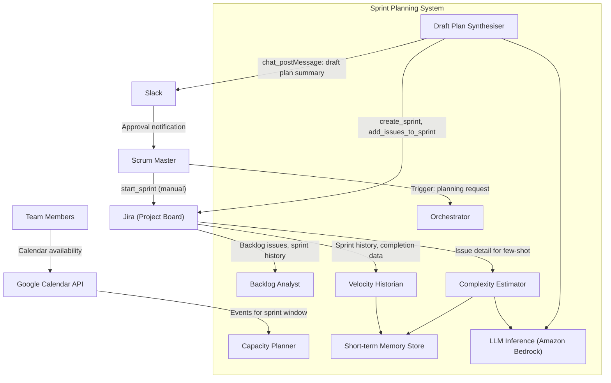
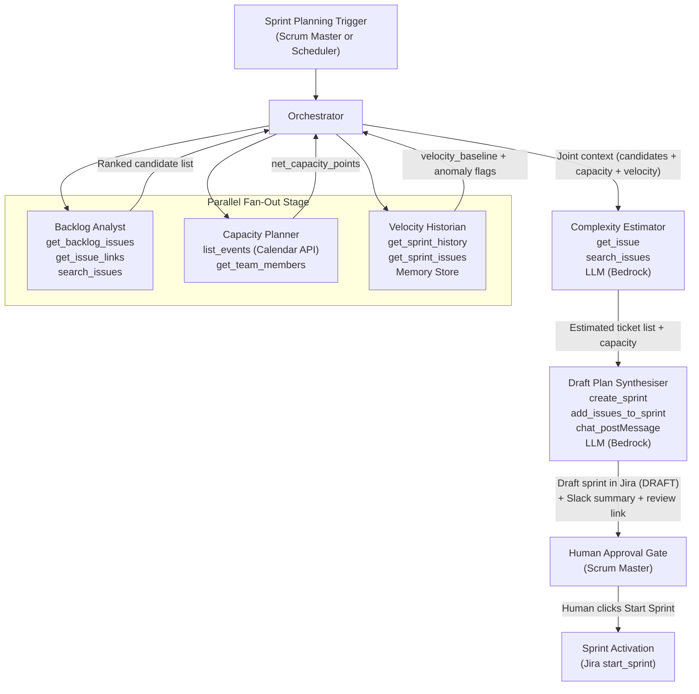
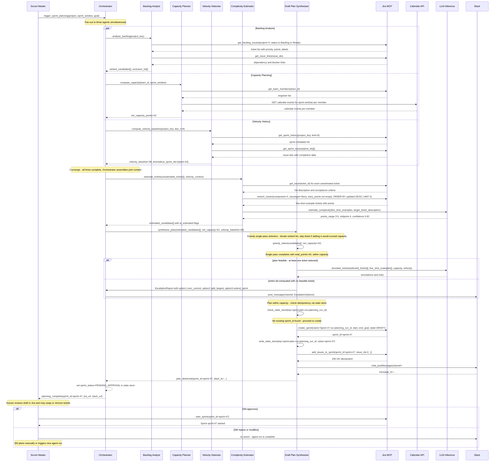

# Project 2 — Intelligent Sprint Planning Agent: Reference Architecture

---

## 1. Overview

### Problem Being Solved

Engineering teams spend 2–4 hours per sprint in planning meetings, manually reconciling backlog priority, team availability, historical velocity, and ticket complexity. The outcome depends heavily on the scrum master's experience and institutional knowledge, is inconsistently applied across teams, and frequently results in over-commitment (15–25% rollover is common) or under-utilisation. New scrum masters take several sprints to reach planning confidence.

### Business Value

- Reduces sprint planning ceremony time from hours to minutes of human review
- Delivers consistent, data-driven sprint recommendations that improve over time
- Cuts rollover rate by anchoring commitments to empirical velocity and realistic capacity
- Accelerates onboarding of new scrum masters by encoding planning heuristics in the agent
- Creates an auditable record of every planning decision and its rationale

### The One-Line Question the Agent Answers

> **Given our backlog, team capacity, and historical velocity, what should be in our next sprint — and why?**

---

## 2. Agent Map

| Agent Name | Single Responsibility | Tools It Uses |
|---|---|---|
| **Orchestrator** | Receives the sprint planning trigger, coordinates the fan-out and convergence stages, manages shared context, and delivers the final plan to the human approver | Internal state store; invokes all sub-agents |
| **Backlog Analyst** | Queries the full product backlog, scores each ticket by priority, dependency status, and staleness, and returns a ranked candidate list | `get_backlog_issues`, `get_issue_links`, `search_issues` (Jira MCP) |
| **Capacity Planner** | Reads team member availability from the calendar API, applies any PTO, holidays, or part-time flags, and computes net sprint capacity in story points | `list_events` (Google Calendar API — `GET /calendar/v3/calendars/{calendarId}/events`), `get_team_members` (Jira MCP) |
| **Velocity Historian** | Fetches the last 5–8 completed sprints, computes a rolling velocity baseline, and flags anomalous sprints (e.g., disrupted by a production incident) to exclude them | `get_sprint_history`, `get_sprint_issues` (Jira MCP); short-term memory store |
| **Complexity Estimator** | For each unestimated ticket in the candidate list, reasons over description, acceptance criteria, and few-shot examples from the team's own history to suggest a story point range | LLM (Amazon Bedrock — Claude via Bedrock); `get_issue` (Jira MCP) for few-shot retrieval |
| **Draft Plan Synthesiser** | Selects tickets up to net capacity in priority order, avoids blocked or orphaned tickets, annotates each selection with reasoning, flags risks, iterates if the plan exceeds capacity, writes the draft sprint to Jira (not yet activated), and sends a Slack summary | `create_sprint`, `add_issues_to_sprint` (Jira MCP); `chat_postMessage` (Slack API); LLM for reasoning |

---

## 3. Tools & Integrations

| Tool / System | Purpose | Notes |
|---|---|---|
| **`get_backlog_issues`** (Jira MCP) | Retrieve all tickets in the project backlog, including priority, status, story points, labels, and epic links | Paginated; supports JQL filters; Backlog Analyst uses this for the candidate pool |
| **`get_issue_links`** (Jira MCP) | Fetch blocked-by, depends-on, and epic hierarchy relationships for a given ticket | Backlog Analyst calls this to exclude blocked/orphaned tickets from the candidate list |
| **`search_issues`** (Jira MCP) | Run JQL queries to find similar historical tickets for few-shot examples | Complexity Estimator uses this to find comparable estimated tickets |
| **`get_sprint_history`** (Jira MCP) | Retrieve metadata for the last N completed sprints (dates, committed points, completed points) | Velocity Historian uses this to build the rolling baseline |
| **`get_sprint_issues`** (Jira MCP) | Fetch the list of issues in a given historical sprint, including their final resolution and story points | Velocity Historian uses this to identify anomalous sprints via completion ratio |
| **`get_issue`** (Jira MCP) | Fetch full detail (description, acceptance criteria, story points, comments) for a single ticket | Complexity Estimator uses this for reasoning input and few-shot construction |
| **`get_team_members`** (Jira MCP) | Retrieve the list of engineers assigned to the project board | Capacity Planner uses this as the team roster before querying the calendar |
| **`create_sprint`** (Jira MCP) | Create a new sprint object in Jira with a name, goal, and date range; leaves it in DRAFT state | Draft Plan Synthesiser only; sprint is NOT started at this stage |
| **`add_issues_to_sprint`** (Jira MCP) | Add selected ticket IDs to the draft sprint created above | Draft Plan Synthesiser only; idempotent if called more than once with the same payload |
| **`list_events`** (Google Calendar API — `GET /calendar/v3/calendars/{calendarId}/events`) | Fetch calendar events for each team member over the sprint window to identify PTO, holidays, and focus-time blocks | Capacity Planner maps event durations to story point deductions using a configurable formula. This is a direct Google Calendar REST API call, not an MCP tool. **Prerequisite:** A Google Workspace service account with domain-wide delegation must be configured with `https://www.googleapis.com/auth/calendar.readonly` scope, granted by the Workspace admin. The service account email and private key are stored in AWS Secrets Manager. |
| **LLM (Amazon Bedrock — Claude via Bedrock)** | Reasoning over ticket descriptions and acceptance criteria for complexity estimation; synthesis of the sprint plan narrative and risk annotations | Amazon Bedrock provides managed, private LLM inference: prompts are not used for model training, and inference runs within AWS's managed infrastructure. Use `bedrock/us.anthropic.claude-sonnet-4-6` (same model ID pattern as Sessions 2, 3, 5, and 6). No separate private hosting (Ollama, Azure OpenAI) required. |
| **`chat_postMessage`** (Slack API) | Post a structured sprint plan summary to the team channel, with a deep-link to the draft Jira sprint (`"Review in Jira → {sprint_board_url}"`) | Draft Plan Synthesiser uses this after the Jira write-back; includes sprint name, total committed points, capacity, 3-sprint velocity trend, and a table of the top 10 tickets with estimated points and one-line reasoning |
| **Short-term memory store** | Velocity Historian stores sprint-level metadata (velocity, anomaly flags, sprint ID) across the planning session to avoid re-querying and to pass context to the Complexity Estimator | In-process key-value store or a lightweight Redis instance; scoped to the current planning run |

---

## 4. Orchestration Pattern

### Pattern Name: Parallel Fan-Out then Converge (Hierarchical Multi-Agent)

### Rationale

Sprint planning has three genuinely independent data-gathering concerns — what exists in the backlog, how much capacity the team has, and what velocity the team has historically delivered. These three concerns share no data dependencies with each other and can run simultaneously without coordination overhead. Running them in parallel cuts wall-clock time by roughly two-thirds compared to a sequential pipeline.

Once all three data streams are available, they must converge before any further reasoning can begin: the Complexity Estimator cannot prioritise unestimated tickets without knowing the candidate pool (from the Backlog Analyst) and the historical ticket examples (from the Velocity Historian). The Synthesiser cannot build a plan without estimated tickets and a capacity figure.

This two-stage structure — wide fan-out then progressive convergence — is a natural fit for planning problems where information gathering is embarrassingly parallel but synthesis is inherently sequential.

### Stages

**Stage 1 — Parallel Fan-Out (simultaneous):**

- **Backlog Analyst** queries the full backlog, scores and ranks candidates, and identifies blocked/orphaned tickets to exclude.
- **Capacity Planner** reads team member calendars over the sprint window, applies availability deductions, and emits a net capacity figure in story points.
- **Velocity Historian** fetches the last 5–8 completed sprints, computes a rolling average, flags anomalous sprints, and stores the baseline in the short-term memory store.

**Stage 2 — Converge into Complexity Estimator:**

All three outputs are joined by the Orchestrator and passed to the **Complexity Estimator**, which processes the unestimated tickets from the candidate list using few-shot examples drawn from the team's own history.

**Stage 3 — Draft Plan Synthesiser:**

The **Draft Plan Synthesiser** receives the fully estimated, ranked candidate list plus the net capacity figure. It uses a standard greedy selection pass: iterates through the ranked list, skips blocked tickets, and skips any ticket that would push the running total above `net_capacity_points` — then continues to the next candidate. The plan is within capacity after a single pass with no correction loop needed. It annotates each selected ticket with reasoning and risk flags.

**Stage 4 — Human-in-the-Loop Delivery:**

The Synthesiser writes the draft sprint to Jira (DRAFT state, not activated) and posts a summary to Slack containing a deep-link: `"Review in Jira → {sprint_board_url}"`. After sending the Slack notification, the Orchestrator sets `sprint_status = PENDING_APPROVAL` in the state store. The Sprint Planning workflow is then complete. Sprint activation happens out-of-band via Jira's native "Start Sprint" button by the Scrum Master — the agent does not await a callback or poll for approval. This is an intentional architectural decision: the agent has no write access to trigger sprint activation, enforcing the HITL constraint at the infrastructure level.

---

## 5. Data & Control Flow

### Trigger

A sprint planning request is initiated — either by a scheduled cron (e.g., two days before sprint end) or manually by the Scrum Master via a Slack command or Jira automation webhook. The Orchestrator receives the request payload containing the project key, the planned sprint window (start date, end date), the sprint goal (optional), and the team identifier. At trigger time, the Orchestrator generates a `planning_run_id` (UUID v4) which is used throughout the run for idempotency and traceability.

### Stage 1: Parallel Fan-Out

The Orchestrator dispatches three concurrent sub-tasks:

**Backlog Analyst path:** The agent calls `get_backlog_issues` with a JQL filter scoped to the project board (status = Backlog OR status = Ready, excluding tickets already in an active sprint). For each ticket, it calls `get_issue_links` to check for unresolved blockers. It assigns a composite score to each ticket: `(priority_weight * 0.5) + (staleness_penalty * 0.3) + (dependency_clear_bonus * 0.2)`. The output is a ranked list of candidate tickets with scores and a separate exclusion list of blocked/orphaned tickets.

**Capacity Planner path:** The agent calls `get_team_members` to retrieve the team roster, then calls `list_events` (`GET /calendar/v3/calendars/{calendarId}/events`) on each member's calendar for the sprint window. It maps full-day out-of-office events to a full-day story point deduction, half-day events to a half-day deduction, and applies a configurable focus-time multiplier (default 0.8) to account for meeting overhead. It sums the available capacity across all team members and emits a single `net_capacity_points` value.

**Velocity Historian path:** The agent calls `get_sprint_history` to retrieve the last 8 completed sprints, then calls `get_sprint_issues` for each sprint to calculate the completion ratio (completed points / committed points). Sprints with a completion ratio below 0.5 are flagged as anomalous (`"low_velocity"`) and **excluded** from the velocity baseline — these are likely disrupted sprints where the team could not function normally. Sprints with a ratio above 1.3 are flagged as `"over_delivery"` but **retained** in the baseline calculation with their contribution capped at ±30% of the running rolling average, preventing outliers from dominating while preserving the signal (consistent over-delivery often reflects systematic underestimation, which is useful data). Both categories of anomalous sprints are surfaced in the Slack notification alongside the human-readable `sprint.notes` if present. The `velocity_baseline` is computed from all retained sprints (including capped over-delivery sprints). This approach avoids systematically underestimating velocity for high-performing teams.

### Stage 2: Convergence into Complexity Estimator

The Orchestrator waits for all three parallel tasks to complete (or times out after 90 seconds and proceeds with available data, flagging any missing input). It assembles the joint context: the ranked candidate list, the net capacity, the velocity baseline, and the anomaly-flagged sprints.

The Complexity Estimator filters the candidate list to tickets where `story_points IS NULL`. For each unestimated ticket, it calls `get_issue` to retrieve the full description and acceptance criteria, then calls `search_issues` with a JQL query to find estimated tickets matching BOTH `component=X` AND `issuetype=Story` (or the same type as the target ticket), ordered by recency: `component=X AND issuetype=Story AND story_points is not EMPTY ORDER BY updated DESC LIMIT 5`. **Note:** This selection is recency-first within the matching component+type filter — among tickets that share the same component and type, the 5 most recently updated are returned. Examples with story points outside [1, 13] are excluded as outliers. If fewer than 3 matching examples are found, the query falls back to the last 5 estimated tickets of the same type across all components. It constructs a few-shot prompt for the LLM: system prompt + historical examples with their actual story points + the target ticket's description and acceptance criteria. The LLM returns a story point range (e.g., 3–5 points) with a confidence level and a one-sentence rationale. The agent assigns the midpoint as the working estimate and tags the ticket as `ai_estimated` for human visibility.

### Stage 3: Draft Plan Synthesiser

The Synthesiser receives the fully estimated, ranked candidate list and the net capacity figure. It uses a standard **greedy selection pass**: it iterates through the ranked list in priority order, maintaining a running total of committed story points. For each ticket: if it is on the exclusion list (blocked, orphaned, or a dependency of a blocked ticket), it is skipped with a recorded reason. If adding the ticket would exceed `net_capacity_points`, it is also skipped — but the algorithm **continues to the next ticket** rather than stopping. This allows smaller lower-priority tickets to fill remaining capacity without ever exceeding it. The plan is within capacity after a single pass; no correction loop is needed.

The escalation path is reserved for when the entire ranked list is exhausted without finding **any** feasible ticket that fits within remaining capacity — a genuinely rare condition (typically only when all high-priority tickets are large and no smaller tickets exist). In this case, the Synthesiser escalates with three explicit options for the Scrum Master:
1. **Accept over-commitment:** Approve the highest-priority ticket even though it exceeds capacity.
2. **Split the largest ticket:** The Synthesiser identifies the single largest ticket and suggests a breakdown into two sub-tasks.
3. **Extend the sprint:** Adjust sprint dates to accommodate the identified scope.

The Synthesiser writes the as-is plan (or Option 1 if escalating) to Jira as a DRAFT sprint and flags it with label `PLANNING_ESCALATION`. The Slack escalation message links to this draft.

For each selected ticket, the Synthesiser writes a brief annotation: priority reason, estimation source (human or AI), and any risk flags (single-engineer dependency, AI-estimated with low confidence, large ticket without subtasks). The annotation pass processes tickets in batches of 20. Each batch prompt includes: the team's top-3 historical annotation examples (as few-shot context), the batch of 20 ticket titles + descriptions truncated to 200 characters each, and the capacity/velocity constraints. Total prompt size per batch is approximately 6,000 tokens. For 80 candidate tickets, 4 sequential LLM calls are made; annotations are accumulated in the state store between batches.

The Synthesiser then calls `create_sprint` to create a DRAFT sprint in Jira with the proposed name and dates. **For idempotency**, the `planning_run_id` is stored as a key in the external state store (Redis or in-process store) at trigger time. Before calling `create_sprint`, the Synthesiser checks the state store for an existing `sprint_id` under the key `sprint-plan-run:{planning_run_id}`. If found, the Synthesiser skips creation and calls `add_issues_to_sprint` against the existing draft sprint instead. The sprint name follows the convention `Sprint {N} [run:{planning_run_id}]` to provide a human-readable idempotency marker in Jira's sprint view. **Note:** `sprint.label` is not a valid Jira JQL field; sprint metadata cannot be queried via JQL label filters, so the state store is the authoritative idempotency record. It then calls `add_issues_to_sprint` with the selected ticket IDs (`add_issues_to_sprint` is naturally idempotent — adding an issue already in the sprint is a no-op).

It posts a structured message to Slack via `chat_postMessage` containing: sprint name, total committed points, capacity, 3-sprint velocity trend, and a table of the top 10 tickets with estimated points and one-line reasoning. The message includes a deep-link: `"Review in Jira → {sprint_board_url}"` (a passive link, not an interactive button). **Note on trust-building mode:** During the initial rollout, the Synthesiser can be configured to skip the Jira write-back and instead include a **"✅ Create Draft in Jira"** interactive button in the Slack message; clicking it (restricted to the `scrum-masters` Slack user group) triggers `create_sprint` + `add_issues_to_sprint`. This graduated approach lets the team review several planning cycles in read-only mode before enabling automatic Jira writes — see Key Behavior #5. Once trust is established, the flow described above (auto-write then passive link) becomes the default. Human edits to the Jira draft sprint (add/remove tickets) do NOT trigger re-processing — the agent run is stateless after delivery. A new run can be triggered manually (e.g., `/sprint-plan` Slack command) which re-reads the current draft state.

### Stage 4: Human Approval and Sprint Activation

After posting the Slack notification, the Orchestrator sets `sprint_status = PENDING_APPROVAL` in the state store. The Sprint Planning workflow is complete. The draft sprint sits in Jira in DRAFT state. The Scrum Master reviews the plan in Jira, optionally removes or swaps tickets, and clicks Jira's native "Start Sprint" button to activate the sprint. The agent does not call `start_sprint` and does not await a callback — sprint activation happens out-of-band. This is an intentional architectural decision: the agent has no write access to trigger sprint activation, enforcing the HITL constraint at the infrastructure level. The post-sprint observer (a separate lightweight agent triggered by a Jira sprint-close webhook) compares committed vs. completed points to update the velocity baseline and track planning accuracy — it is fully specified in NFR 4 and runs outside the planning pipeline.

---

## 6. Diagrams

### 6.1 System Context Diagram

### 6.2 Agent Map Diagram

### 6.3 Sequence Diagram — Happy Path

---

## 7. Key Agentic Behaviors

1. **Multi-step reasoning for complexity estimation.** The Complexity Estimator does not apply keyword rules or lookup tables. Instead, it constructs a chain-of-thought prompt: it provides the LLM with the 5 most recently estimated tickets matching BOTH `component=X` AND `issuetype=Story` (or the same type as the target ticket), ordered by recency (`ORDER BY updated DESC LIMIT 5`). If fewer than 3 matching examples are found, it falls back to the last 5 estimated tickets of the same type across all components. Examples with story points outside [1, 13] are excluded as outliers. **Note on selection:** This query applies component+type filtering as the WHERE clause, then ranks by recency within those results — it is recency-first within the matching component+type, not similarity-first across the full history. Each example includes the ticket description, acceptance criteria, and the actual story points assigned by the team. The LLM reasons step by step — identifying the scope of changes implied by the acceptance criteria, comparing the scope to the historical examples, and arriving at a story point range with a confidence level and a written rationale. This means estimation improves over time as the team's own history grows, and it handles novel ticket types by reasoning from first principles rather than failing silently.

2. **Memory of past sprints via Velocity Historian.** The Velocity Historian does not blindly average all historical sprints. It maintains a short-term memory store during the planning run, tagging each sprint with an anomaly flag and a reason derived from the completion ratio band: `ratio < 0.50` → `"low_velocity"` (excluded from the baseline — likely a disrupted sprint where normal delivery was impossible); `ratio > 1.30` → `"over_delivery"` (flagged for human review, but **retained** in the baseline with its contribution capped at ±30% of the running rolling average). Capping rather than excluding over-delivery sprints preserves the signal: a team that consistently delivers above 1.3x is likely systematically underestimating story points, which is valid data. Auto-excluding these sprints would produce an artificially conservative baseline and lead to chronic under-commitment. The anomaly reason is a categorisation label, not a semantic description — sprint content is not parsed to infer cause. Human-readable notes (e.g., "production incident week") are preserved separately in `sprint.notes` if present and surfaced verbatim in the Slack notification alongside the label. All anomalous flags are surfaced in the Synthesiser's risk annotations to inform the Scrum Master.

3. **Greedy selection with single-pass convergence.** The Synthesiser uses a standard greedy algorithm that is guaranteed to produce a within-capacity plan in a single pass — no correction loop is needed. It iterates through the ranked candidate list in priority order, maintaining a running total. For each ticket: if it is blocked or orphaned, it is skipped; if adding it would push the total above `net_capacity_points`, it is **skipped** (not removed after the fact) — and the pass continues, allowing smaller lower-priority tickets to fill remaining capacity. This is the key distinction from an overshoot-then-remove loop: the algorithm never adds a ticket that would exceed capacity, so the running total is always within bounds. Escalation is reserved for the genuinely rare case where the entire ranked list is exhausted without producing any feasible plan — meaning ALL candidate tickets are individually larger than the remaining capacity. In this case, the Synthesiser writes an as-is over-committed plan to Jira as a DRAFT sprint flagged `PLANNING_ESCALATION` and posts three explicit options to Slack. The algorithm's single-pass design means the agentic "reasoning" work happens in the **annotation** step — each selected ticket receives a written explanation of why it was chosen, which risk flags apply, and whether its estimate is human or AI-derived.

4. **Human-in-the-loop — sprint never activated without explicit approval.** The agent's write-back to Jira creates the sprint in DRAFT state using `create_sprint` with `state=DRAFT` and populates it via `add_issues_to_sprint`. The agent never calls `start_sprint`. After posting the Slack notification, the Orchestrator sets `sprint_status = PENDING_APPROVAL` in the state store — the agent does not await a callback. Sprint activation is a deliberate human action via Jira's native "Start Sprint" button. The Slack notification includes a deep-link: `"Review in Jira → {sprint_board_url}"` (a passive link, not an interactive button). The Slack message contains: sprint name, total committed points, capacity, 3-sprint velocity trend, and a table of the top 10 tickets with estimated points and one-line reasoning. The full draft is visible in Jira. Human edits to the Jira draft sprint (add/remove tickets) do NOT trigger re-processing — the agent run is stateless after delivery. A new run can be triggered manually (e.g., `/sprint-plan` Slack command) which re-reads the current draft state. This is a hard architectural constraint, not a soft preference: the agent has no write access to trigger sprint activation, enforcing the HITL constraint at the infrastructure level.

5. **Trust-building before full write-back is enabled.** The graduated trust model is implemented as a Slack approval gate rather than an environment variable toggle. After the agent produces a sprint plan recommendation, the Slack notification includes a single interactive action button: **"✅ Create Draft in Jira"** (restricted to users in the `scrum-masters` Slack user group). Clicking the button triggers the `create_sprint` and `add_issues_to_sprint` Jira write calls. If the button is not clicked, no Jira writes occur — the recommendation exists only in Slack. This design has three advantages over an environment variable: (1) the trust decision is visible and self-managed by the Scrum Master, not a DevOps configuration gate; (2) the button is part of the normal planning workflow, making the escalation path natural; (3) the Scrum Master can run several planning cycles in read-only mode simply by reviewing the Slack output without clicking, then enable write-back for a specific sprint by clicking once. Sprint activation (`start_sprint`) is always gated on a separate human action via Jira's native "Start Sprint" button — the agent never activates sprints regardless of trust level. After 3–5 planning cycles, the team reviews a planning accuracy report (committed vs. completed points, rollover rate trend) surfaced in the NFR 4 Confluence dashboard before enabling write-back as the default flow.

---

## 8. Non-Functional Requirements

### NFR 1: Security — Scoped Jira Permissions and Private LLM Inference

**Requirement:** All read-only agents (Backlog Analyst, Capacity Planner, Velocity Historian, Complexity Estimator) must use a Jira service account token scoped exclusively to `read:jira-work`. Only the Draft Plan Synthesiser uses a token scoped to `write:jira-work` for `create_sprint` and `add_issues_to_sprint`. Ticket content sent to the LLM must not leave the organisation's private infrastructure.

**Risk:** If a read-only agent's token is compromised, the blast radius is limited to data exfiltration (bad). If the Synthesiser's write token is compromised, an attacker could create or populate sprints with arbitrary content (worse). Ticket descriptions frequently contain customer names, contract details, and security vulnerability information — sending them to a public LLM API violates data handling obligations.

**Design Approach:** Two separate service accounts: `sprint-agent-reader` (read-only scopes) used by all gathering agents, and `sprint-agent-writer` (write scopes, strictly limited to sprint CRUD) used exclusively by the Synthesiser. The `sprint-agent-writer` service account's `write:jira-work` OAuth scope is further restricted to sprint management operations only via a Jira permission scheme that denies issue creation (`create_issues` permission = DENY) and issue transitions (`transition_issues` permission = DENY). This scopes the blast radius of a compromised write token to sprint creation and issue assignment only. The write token is not passed to any other agent. All credentials are stored in **AWS Secrets Manager** and injected at runtime — never committed to source control.

LLM inference uses **Amazon Bedrock (Claude via Bedrock)** — the same `bedrock/us.anthropic.claude-sonnet-4-6` model ID pattern used in Sessions 2, 3, 5, and 6. Amazon Bedrock provides private inference within AWS's managed infrastructure: prompts are not stored or used for model training by default, and no customer data leaves the AWS network boundary. This satisfies the "private inference" requirement without requiring on-premises hosting (Ollama) or a separate cloud vendor (Azure OpenAI). A prompt injection scanner (similar to the security patterns covered in Session 6) runs on each ticket description before it is included in an LLM prompt, checking for known injection patterns (e.g., "ignore previous instructions").

---

### NFR 2: Reliability — 5-Minute SLA and Idempotent Writes

**Requirement:** The sprint plan must be available (written to Jira and posted to Slack) within 5 minutes of the planning trigger. Write operations to Jira must be idempotent — triggering the planning run twice must not create duplicate sprints or add duplicate tickets.

**Risk:** The parallel fan-out stage involves multiple external API calls (Jira, Calendar API), each of which can be slow or intermittently unavailable. If the Jira API is degraded, the write-back stage could create a partially-populated sprint, leaving the team with a misleading draft. Running the agent twice (e.g., by impatient retries) could create two draft sprints for the same period.

**Design Approach:** The Orchestrator enforces a 90-second timeout on the parallel fan-out stage. If any one agent exceeds the timeout, the Orchestrator proceeds with the data it has and marks the missing data source as unavailable, triggering a degraded-mode warning in the Slack notification. For idempotency: at trigger time, the Orchestrator generates a `planning_run_id` (UUID v4) and writes it to the external state store (Redis or in-process key-value store) under the key `sprint-plan-run:{planning_run_id}`. Before calling `create_sprint`, the Synthesiser checks the state store for an existing `sprint_id` under that key. If found, the Synthesiser skips `create_sprint` and calls `add_issues_to_sprint` against the existing draft sprint instead. **Note:** `sprint.label` is not a valid Jira JQL field — sprint metadata cannot be queried via JQL label filters, so the state store is the authoritative idempotency record. The sprint name follows the convention `Sprint {N} [run:{planning_run_id}]` to provide a human-readable idempotency marker in Jira's sprint view without requiring a JQL query. `add_issues_to_sprint` in the Jira API is naturally idempotent (adding an issue already in the sprint is a no-op). Total wall-clock budget: fan-out (90s) + Complexity Estimator (60s) + Synthesiser greedy selection and annotation (60s) + write-back and Slack (30s) = 240s, well within the 5-minute SLA.

---

### NFR 3: Scale — Backlogs up to 500 Tickets, Teams up to 15

**Requirement:** The agent must handle project backlogs with up to 500 tickets and teams of up to 15 engineers without degrading below the 5-minute SLA or exceeding LLM context window limits.

**Risk:** Passing 500 ticket descriptions to the LLM in a single prompt is not feasible — it exceeds context window limits and produces unreliable outputs. Fetching 500 individual issues sequentially via `get_issue` for complexity estimation would take many minutes.

**Design Approach:** The Backlog Analyst's scoring step filters the 500-ticket backlog to the top 50–80 highest-priority candidates before passing to the Complexity Estimator. This is a deterministic filter (priority + staleness score), not an LLM operation, so it is fast and reliable. For complexity estimation, the Complexity Estimator only processes tickets where `story_points IS NULL` within those top 50–80 — typically 10–20 tickets per sprint cycle. Jira API calls are batched (fetch 50 issues per API call) to stay within rate limits. Calendar API calls for up to 15 engineers are made in parallel with a concurrency limit of 5. The Synthesiser's annotation pass processes tickets in batches of 20. Each batch prompt includes: the team's top-3 historical annotation examples (as few-shot context), the batch of 20 ticket titles + descriptions truncated to 200 characters each, and the capacity/velocity constraints. Total prompt size per batch is approximately 6,000 tokens. For 80 candidate tickets, 4 sequential LLM calls are made; annotations are accumulated in the state store between batches.

---

### NFR 4: Observability — Planning Accuracy via Rollover Rate Tracking

**Requirement:** The system must track planning accuracy over time so that the value of the agent can be demonstrated and model drift (e.g., team velocity changing) can be detected.

**Risk:** Without observability, the team cannot know whether the agent's recommendations are improving outcomes or introducing systematic over- or under-commitment. Silent degradation (e.g., if the Complexity Estimator's estimates are consistently too low) would manifest only as continued rollover, with no clear signal that the agent is the cause.

**Design Approach:** At sprint close (triggered by the sprint moving to DONE status in Jira, via a webhook), a lightweight post-sprint observer agent fetches the completed sprint's committed vs. completed points via `get_sprint_issues`. It calculates the rollover rate (`(committed - completed) / committed`) and writes it to a dedicated metrics table in the same database used as the agent's state store (e.g., PostgreSQL or DynamoDB). Each record contains: `sprint_id`, `committed_points`, `completed_points`, `rollover_rate`, `agent_plan_used: boolean`, `planning_run_id`. Records are retained for 24 months. The baseline for drift detection uses a rolling 8-sprint window. Sprints flagged as anomalous by the Velocity Historian are excluded from rollover rate trend calculations. A weekly dashboard (Confluence page updated via the Atlassian MCP) surfaces rollover trend, velocity baseline drift, and AI estimation error (predicted midpoint vs. actual points). If rollover rate exceeds 20% for two consecutive sprints, the agent emits a Slack alert to the Scrum Master recommending a manual calibration review.

---

## 9. Edge Cases & Failure Modes

### Edge Case 1: Velocity Baseline Unreliable (New Team or Major Incident Sprint)

**Scenario:** The team has fewer than 3 completed sprints (new team), or all recent sprints were affected by production incidents, leaving no clean velocity signal. The Velocity Historian cannot compute a meaningful baseline.

**Failure Mode:** If the agent proceeds with an artificially low or high velocity baseline, the Synthesiser will over- or under-commit the sprint. For a new team, there are no historical estimation examples for few-shot learning either.

**Handling:** The Velocity Historian applies a minimum sample threshold: if fewer than 3 non-anomalous sprints exist, it flags the baseline as `unreliable` and falls back to the team's stated planning capacity (a configuration value set by the Scrum Master during onboarding, e.g., "team target velocity = 36 points"). The Complexity Estimator falls back to cross-project examples from similar components when team-specific history is insufficient. The Synthesiser includes a prominent risk annotation in the Slack notification: "Velocity baseline based on fewer than 3 clean sprints — treat committed points as a first estimate, not a firm commitment."

---

### Edge Case 2: Team Member Availability Data Missing from Calendar API

**Scenario:** One or more engineers have not shared their calendar with the service account, or the Calendar API returns a 403 or timeout for specific users.

**Failure Mode:** The Capacity Planner cannot account for PTO or holiday coverage for the affected engineers, leading to an inflated capacity estimate and likely over-commitment.

**Handling:** The Capacity Planner tracks which engineers returned successful calendar data and which did not. For engineers without availability data, it applies a conservative default: assume 80% availability (the focus-time multiplier only, no PTO deducted). The net capacity figure is annotated with a warning listing the engineers whose calendars were inaccessible. The Slack notification surfaces this explicitly: "Capacity estimate may be overstated — availability data missing for: [engineer names]. Confirm their availability before approving." This is a degraded-mode result, not a failure.

---

### Edge Case 3: Complexity Estimator Cannot Estimate (No Prior Similar Tickets)

**Scenario:** A ticket is in a brand-new technical domain (e.g., first ML feature in a traditionally backend team), and there are no comparable estimated tickets in the team's history to use as few-shot examples.

**Failure Mode:** The LLM produces an unreliable estimate with very low confidence, or the estimate is wildly off because there is no grounding data.

**Handling:** The Complexity Estimator checks the LLM's returned confidence level against a threshold (default: 0.65). If confidence is below the threshold and no suitable few-shot examples were found, the ticket is tagged `estimation_skipped: insufficient_history` and returned to the candidate list with its story points as NULL. The Synthesiser treats these tickets differently: it places them at the end of the priority queue (to avoid committing to an unknown), adds a risk annotation ("Unestimated — requires team estimation in planning meeting"), and optionally excludes them from the sprint if capacity is already satisfied by estimated tickets. The Slack notification lists all skipped tickets so the team can estimate them manually at the top of the planning meeting.

---

### Edge Case 4: Greedy Selection Finds No Feasible Ticket

**Scenario:** The highest-priority tickets are all large (8–13 points), and the net capacity is, for example, 20 points. After the greedy pass exhausts the entire ranked list, no ticket was added because every candidate individually exceeds the remaining capacity — leaving a plan with zero committed points.

**Failure Mode:** Without a feasible ticket selection, the Synthesiser cannot produce a meaningful sprint plan. This is the genuine edge case the greedy algorithm cannot resolve in a single pass: not over-commitment, but a total mismatch between ticket granularity and available capacity.

**Handling:** After the full greedy pass completes with an empty selection, the Synthesiser escalates immediately with three explicit options for the human:

1. **Accept over-commitment:** Approve the plan at N points (X% over capacity) with full awareness.
2. **Split the largest ticket:** The Synthesiser identifies the single ticket most responsible for the overage and suggests a breakdown into two sub-tasks.
3. **Defer the blocking ticket:** Remove the specified ticket from the sprint and pull in the next-priority item that fits within capacity.

When no feasible plan is found, the Synthesiser writes Option 1 (the single highest-priority ticket, intentionally over-committed) to Jira as a DRAFT sprint and flags it with label `PLANNING_ESCALATION`. The Slack escalation message links to this draft. If the Scrum Master selects Option 2 or Option 3 via a Jira comment reply (`/accept option2`), a new agent run is triggered with a scope constraint parameter. The current run is otherwise complete.

---

### Edge Case 5: Human Rejects the Draft and Plans Manually

**Scenario:** The Scrum Master reviews the draft, disagrees with the selection (perhaps due to political or strategic context the agent cannot know), closes the draft sprint, and plans the sprint manually.

**Failure Mode:** The agent's recommendations become invisible noise if the team routinely ignores them, and the agent receives no feedback signal to improve.

**Handling:** This is an explicitly supported outcome, not a failure. The post-sprint observer tracks whether the activated sprint matches the agent's draft (by comparing the final sprint's issue list against the stored draft). If the overlap is below 50%, it records the sprint as a "manual override" and logs it in the planning accuracy metrics. Over time, a pattern of low overlap signals that the agent's priorities are misaligned with the team's actual priorities — a prompt for the Scrum Master to review the backlog scoring weights or the ticket priority hygiene in Jira. The agent never blocks or delays manual planning: the Scrum Master can always proceed directly to Jira without interacting with the agent's output.
