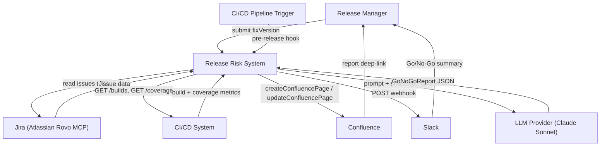
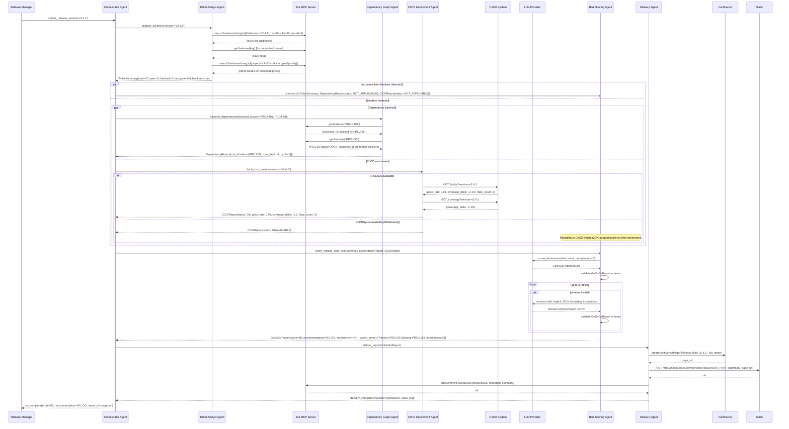

# Project 3 Reference Architecture: Release Risk Assessment & Go/No-Go Agent

---

## 1. Overview

### Problem Being Solved

Before every software release, engineering and release management teams spend 1 to 3 hours in a manual pre-release review. They walk through open tickets, check if blockers are resolved, verify test coverage, and assess team readiness. This process is inconsistent and depends on tribal knowledge. The outcome is a gut-feel decision made under time pressure. Bad releases slip through, and good releases are delayed unnecessarily.

### Business Value

- Eliminates 1 to 3 hours of manual pre-release review per release cycle
- Produces a consistent, auditable, data-driven Go/No-Go decision every time
- Surfaces hidden dependency blockers that manual review routinely misses
- Reduces "bad release" incidents by catching unresolved upstream blockers before they reach production
- Creates a historical record of risk scores and decisions that can be used to calibrate the process over time

### The One-Line Question the Agent Answers

> **Given a Jira release version, should we ship it? And if not, exactly what needs to be fixed first?**

---

## 2. Agent Map

| Agent Name | Single Responsibility | Tools It Uses |
|---|---|---|
| **Orchestrator Agent** | Accepts the release version as input, sequences the pipeline, fans out to sub-agents in order, aggregates results, and handles timeouts and partial failures | `searchJiraIssuesUsingJql`, internal state store |
| **Ticket Analyst Agent** | Fetches all Jira tickets for the target `fixVersion`, classifies each by type and resolution status, retrieves sprint load via a JQL proxy, and emits a structured ticket summary | `searchJiraIssuesUsingJql` (by `fixVersion` and by open-sprint team load), `getJiraIssue`, LLM reasoning |
| **Dependency Graph Agent** | Traverses the dependency graph (blocked-by, depends-on, epic hierarchy, subtask relationships) using BFS with visited-set deduplication and a configurable depth limit, identifies unresolved upstream blockers, and detects circular dependencies | `getJiraIssue` (internal issue links are returned in its `issuelinks` field), `getIssueLinkTypes` for link-type metadata, BFS traversal loop |
| **CI/CD Enrichment Agent** | Queries CI/CD pipelines for the target version's test pass rate, coverage delta, and flaky test count, and marks data as unavailable if the adapter is unreachable | CI/CD REST API (`GET /builds`, `GET /coverage`), timeout guard |
| **Risk Scoring Agent** | Receives structured data from the upstream agents, computes a weighted risk score across four dimensions, and produces a `GoNoGoReport` JSON object with per-dimension scores and a confidence level | LLM reasoning (temperature=0), `GoNoGoReport` schema validator, retry loop |
| **Delivery Agent** | Publishes the final risk report to Confluence, posts a summary to Slack, and adds a comment to the release tracking issue in Jira (see Section 5, Stage 4) | `createConfluencePage` / `updateConfluencePage`, Slack incoming webhook (REST `POST`), `addCommentToJiraIssue` |

### Team Capacity Data Source (Proxy Metric)

The Ticket Analyst Agent approximates team load by calling `searchJiraIssuesUsingJql` with a JQL query such as `project = X AND sprint in openSprints() AND assignee in membersOf("{team_name}")` to retrieve open sprint issues assigned to the release team. The `{team_name}` parameter is provided by the Release Manager at invocation time alongside the `fixVersion`. The count and status distribution of those issues serve as a proxy for team capacity. This is explicitly a proxy. The Jira MCP server does not expose a direct team capacity or sprint velocity endpoint, so open sprint load is used as the best available signal.

### GoNoGoReport JSON Schema

The Risk Scoring Agent is required to produce a `GoNoGoReport` object conforming to the following schema:

```json
{
  "release_version": "string",
  "recommendation": "GO | NO_GO | CONDITIONAL_GO",
  "composite_score": "integer (0-100)",
  "threshold_used": "integer (0-100)",
  "confidence": "HIGH | MEDIUM | LOW",
  "dimension_scores": {
    "blocker_count": "integer (0-10)",
    "test_health": "integer (0-10)",
    "team_load": "integer (0-10)",
    "dependency_depth": "integer (0-10)"
  },
  "action_items": ["string"],
  "data_completeness": "FULL | PARTIAL",
  "generated_at": "ISO 8601 timestamp"
}
```

> **Note on `threshold_used`:** The Go/No-Go threshold is configurable by the Release Manager before each run (default: 40). The `threshold_used` field records which threshold produced the recommendation. This ensures audit reproducibility. Two runs with identical risk scores but different thresholds will produce different recommendations, and both are captured in the record.

This schema is validated by the inline JSON Schema validator after each LLM call in the Risk Scoring Agent. Schema validation failure triggers the structured output retry loop (see Section 7, item 2).

---

## 3. Tools & Integrations

All Jira and Confluence tools are accessed via the Atlassian Rovo MCP server.

| Tool/System | Purpose | Notes |
|---|---|---|
| **Jira: `searchJiraIssuesUsingJql`** | Fetches issues for the target `fixVersion`, and also runs the open-sprint team-load query | Returns issue keys, summaries, types, statuses, and links. Paginated for large releases |
| **Jira: `getJiraIssue`** | Fetches full issue detail, including the `issuelinks` field that holds internal dependency links (blocked-by, depends-on, subtask) | Called iteratively during BFS traversal. One issue per call, no bulk fetch available |
| **Jira: `getIssueLinkTypes`** | Returns the configured issue link types so the agent can interpret link directions correctly | Used to distinguish blocking from non-blocking link types |
| **Jira: `addCommentToJiraIssue`** | Posts the Go/No-Go recommendation as a comment on the release tracking issue | Scoped to comment-write only. Does not mutate issue fields |
| **LLM (Claude)** | Classifies tickets, reasons over dependency chains, and produces structured risk output | Used by Ticket Analyst, Dependency Graph Agent, and Risk Scoring Agent. Risk Scoring uses `temperature=0` |
| **Structured Output Schema Validator** | Validates the Risk Scoring Agent output against the `GoNoGoReport` schema before delivery | Runs inline after each LLM call. Triggers the retry loop on failure |
| **CI/CD REST API** | `GET /builds` and `GET /coverage` fetch test pass rate, flaky count, and coverage delta for the target version | Optional enrichment. The system continues with a degraded report if unavailable |
| **Confluence: `createConfluencePage` / `updateConfluencePage`** | Publishes the full structured risk report to a pre-configured Confluence space | Page title includes version and timestamp for discoverability |
| **Slack incoming webhook** | Posts a concise Go/No-Go summary to a designated release channel via a REST `POST` | Uses Block Kit formatting and a deep-link to the Confluence report. This is a direct webhook call, not an MCP tool |
| **Internal State Store (in-memory or Redis)** | Holds aggregated agent outputs across stages and lets the Orchestrator detect partial completion on timeout | Keyed by `releaseVersion + runId`, with a 30-minute TTL |

---

## 4. Orchestration Pattern

### Pattern Name: Hierarchical with Parallel Fan-Out

### Rationale

The release risk assessment has a natural dependency ordering. You cannot score risk before you know what tickets exist. Once you have the ticket list, you can analyze dependencies and query CI/CD at the same time, since those two concerns are independent. This makes a flat sequential pipeline wasteful. Hierarchical orchestration with a controlled parallel fan-out at the middle stage reduces total wall-clock time while preserving the correctness of data dependencies.

The Orchestrator acts as a stateful coordinator. It does not perform analysis itself. It manages execution order, monitors sub-agent completions, handles partial failures, and enforces the 5-minute hard SLA.

### Specific Stages

**Stage 1: Ticket Analysis (sequential, blocking)**
The Orchestrator invokes the Ticket Analyst Agent first. No downstream work can begin without the full ticket inventory. The Ticket Analyst returns a structured `TicketSummary` object containing ticket counts by type and status, a list of unresolved tickets, and a boolean `has_potential_blockers` flag. If `has_potential_blockers` is false, the Orchestrator short-circuits straight to Stage 3, skipping dependency traversal.

**Stage 2: Parallel Fan-Out (conditional, concurrent)**
If blockers were detected, the Orchestrator fans out to two agents simultaneously:
- **Dependency Graph Agent**: traverses issue links using BFS to build the full blocker chain
- **CI/CD Enrichment Agent**: queries build pipelines for test and coverage data

Both run concurrently. The Orchestrator waits for both to complete or until the per-stage timeout is reached. If either times out, the Orchestrator marks that dimension's data as `UNAVAILABLE` and continues.

**Stage 3: Risk Scoring (sequential, blocking)**
The Risk Scoring Agent receives the aggregated outputs from Stages 1 and 2. It scores risk across four weighted dimensions and produces a `GoNoGoReport` JSON object. If structured output validation fails, a self-correction retry loop fires (up to 3 retries).

**Stage 4: Delivery (sequential, fire-and-forget per channel)**
The Delivery Agent receives the validated `GoNoGoReport` and publishes it to Confluence, Slack, and Jira in parallel sub-calls. Failure of any single delivery channel is logged but does not block the others.

---

## 5. Data & Control Flow

**Trigger:** A Release Manager or an automated pipeline hook submits a release version string (e.g., `v2.4.1`) to the Orchestrator Agent. This can come via a CLI invocation, a Slack slash command, or a pre-release pipeline trigger.

**Stage 1: Ticket Collection and Classification:**
The Orchestrator calls the Ticket Analyst Agent with the version string. The Ticket Analyst calls `searchJiraIssuesUsingJql` with JQL `fixVersion = "v2.4.1"`, paginating to retrieve all tickets. For each issue, it uses LLM reasoning to classify the type and normalizes the resolution status into one of `DONE`, `IN_PROGRESS`, `OPEN`, or `BLOCKED`. It also runs the open-sprint team-load query as a capacity proxy. All user identity fields are stripped at this normalization step (see Security NFR). The agent aggregates the results into a `TicketSummary` and sets `has_potential_blockers = true` if any open issue is `BLOCKED` or has an `is-blocked-by` link. The `TicketSummary` is written to the state store and returned to the Orchestrator.

**Conditional Short-Circuit:**
The Orchestrator checks `has_potential_blockers`. If false, it skips Stage 2 entirely. Both the Dependency Graph Agent and the CI/CD Enrichment Agent are skipped. The Orchestrator passes `DependencyReport{status: NOT_APPLICABLE}` and `CICDReport{status: NOT_APPLICABLE}` to the Risk Scoring Agent, which treats those dimensions as N/A and redistributes their weights. This path cuts run time substantially for clean releases and avoids hundreds of unnecessary Jira API calls.

**Stage 2: Parallel Fan-Out (when blockers exist):**
The Orchestrator dispatches two sub-agents simultaneously.

The Dependency Graph Agent runs a breadth-first traversal starting from each blocked issue. It visits each linked issue once using a visited set, with a configurable depth limit (`MAX_TRAVERSAL_DEPTH`, default: 5). The visited set also handles circular references. For each node, it calls `getJiraIssue` and reads the internal links from the returned `issuelinks` field, then enqueues any unresolved upstream dependency. There is no bulk issue-fetch tool, so each call fetches one issue. The output is a `DependencyReport` containing the blocker chain, the depth of the deepest dependency, and a list of unresolved root blockers.

The CI/CD Enrichment Agent calls `GET /builds` and `GET /coverage` against the configured CI/CD adapter. If the adapter is unreachable or returns a non-2xx response within its timeout, the agent returns a `CICDReport` with `status: UNAVAILABLE` and null metrics. This is noted in the final output.

**Stage 3: Risk Scoring:**
Once both Stage 2 agents complete (or time out), the Orchestrator collects the `TicketSummary`, `DependencyReport`, and `CICDReport` and passes all three to the Risk Scoring Agent.

The Risk Scoring Agent invokes the LLM at `temperature=0` with a structured prompt containing the three data objects and a scoring rubric. The LLM scores four dimensions: Blocker Count and Severity, Dependency Chain Depth and Root Blocker Count, CI/CD Health, and Team Load. Each dimension is scored 0 to 10 and multiplied by its configured weight to produce a composite score (0 to 100). The LLM also outputs a confidence level and a Go, No-Go, or Conditional Go recommendation with action items for any No-Go condition. (See Section 7, item 4 for the weights and rubric.)

The output is validated against the `GoNoGoReport` schema. If validation fails, the retry loop fires (see Section 7, item 2).

**Stage 4: Delivery:**
The validated `GoNoGoReport` is passed to the Delivery Agent, which executes three delivery operations:
1. Calls `createConfluencePage` (or `updateConfluencePage` if a page already exists for this version) to publish the full report.
2. Posts a condensed Block Kit summary to the Slack incoming webhook, including the composite score, recommendation, confidence, and a deep-link to the Confluence page.
3. Calls `addCommentToJiraIssue` on the **release tracking issue**. Because Jira `fixVersion` objects are project metadata rather than issues, `addCommentToJiraIssue` needs an issue key. The Orchestrator first resolves that key with a `searchJiraIssuesUsingJql` query against a release-tracker convention (e.g., `labels = "release-tracker" AND summary ~ "v2.4.1"`). If no match is found, the Jira comment is skipped and a warning is logged.

The Orchestrator marks the run `COMPLETE` in the state store and logs the final score, recommendation, confidence, `threshold_used`, and full decision path to the audit log (a Langfuse trace, see NFR 4).

**Total elapsed time target: under 5 minutes for releases up to 500 tickets.**

---

## 6. Diagrams

### 6.1 System Context Diagram



### 6.2 Agent Map Diagram

```mermaid
graph TD
    OA["Orchestrator Agent\n(sequence + fan-out control)"]

    TA["Ticket Analyst Agent"]
    TA_T1["searchJiraIssuesUsingJql\n(fixVersion + openSprints)"]
    TA_T2["getJiraIssue"]
    TA_T3["LLM: classify + summarise"]

    subgraph parallel_stage2["Stage 2: Parallel Fan-Out (simultaneous)"]
        DGA["Dependency Graph Agent"]
        DGA_T1["getJiraIssue (reads issuelinks)"]
        DGA_T2["getIssueLinkTypes"]
        DGA_T3["BFS traversal + visited set\n(MAX_TRAVERSAL_DEPTH=5)"]

        CICD_A["CI/CD Enrichment Agent"]
        CICD_T1["GET /builds"]
        CICD_T2["GET /coverage"]
        CICD_T3["timeout guard"]
    end

    RSA["Risk Scoring Agent"]
    RSA_T1["LLM: weighted risk scoring\n(temperature=0)"]
    RSA_T2["GoNoGoReport schema validator"]
    RSA_T3["retry loop (max 3)"]

    DA["Delivery Agent"]
    DA_T1["createConfluencePage /\nupdateConfluencePage"]
    DA_T2["POST Slack webhook"]
    DA_T3["addCommentToJiraIssue"]

    OA -->|"stage 1: ticket list"| TA
    TA --> TA_T1
    TA --> TA_T2
    TA --> TA_T3
    TA -->|"TicketSummary"| OA

    OA -->|"stage 2a: parallel fan-out\n(if blockers detected)"| DGA
    DGA --> DGA_T1
    DGA --> DGA_T2
    DGA --> DGA_T3
    DGA -->|"DependencyReport"| OA

    OA -->|"stage 2b: parallel fan-out\n(simultaneous with DGA)"| CICD_A
    CICD_A --> CICD_T1
    CICD_A --> CICD_T2
    CICD_A --> CICD_T3
    CICD_A -->|"CICDReport"| OA

    OA -->|"stage 3: all data"| RSA
    RSA --> RSA_T1
    RSA --> RSA_T2
    RSA --> RSA_T3
    RSA -->|"GoNoGoReport"| OA

    OA -->|"stage 4: report"| DA
    DA --> DA_T1
    DA --> DA_T2
    DA --> DA_T3
```



### 6.3 Sequence Diagram: Happy Path



---

## 7. Key Agentic Behaviors

1. **Conditional Planning / Short-Circuit (no blockers detected)**
   After Stage 1, the Orchestrator evaluates the `has_potential_blockers` flag before committing to Stage 2. If no blocked or dependency-linked open tickets exist, it skips Stage 2 entirely. Both the Dependency Graph Agent and the CI/CD Enrichment Agent are skipped. The Orchestrator passes `DependencyReport{status: NOT_APPLICABLE}` and `CICDReport{status: NOT_APPLICABLE}` to the Risk Scoring Agent, which redistributes the weight of the N/A dimensions proportionally across the remaining dimensions and labels them `NOT_APPLICABLE` in the report. This path cuts run time substantially for clean releases and avoids hundreds of unnecessary Jira API calls. It is a genuine planning decision made at runtime based on observed data, not a static workflow branch.

2. **Self-Correction via Structured Output Retry Loop**
   The Risk Scoring Agent is required to emit a `GoNoGoReport` that conforms to the strict JSON schema defined in Section 2. After each LLM call, the output is validated against the schema using a JSON Schema validator. If validation fails (missing field, wrong type, out-of-range score), the retry strategy escalates progressively:
   - **Retry 1:** Append the explicit JSON schema definition to the prompt with the original data and the specific validation errors.
   - **Retry 2:** Reduce temperature to 0 (already set) and add "Output ONLY valid JSON, no prose." to the prompt.
   - **Retry 3:** Use a simplified prompt with only mandatory fields (`recommendation`, `composite_score`, `action_items`).
   - **After 3 failures:** Return `GoNoGoReport{data_completeness: PARTIAL, recommendation: HUMAN_REVIEW_REQUIRED}` with raw dimension scores in a `raw_scores_unvalidated` field so delivery is not blocked.

3. **Graceful Degradation When CI/CD Data Is Unavailable**
   The CI/CD Enrichment Agent enforces a hard timeout. If the CI/CD adapter is unreachable, returns an error, or times out, the agent returns `CICDReport{status: UNAVAILABLE}` with null metrics rather than propagating an exception. The Risk Scoring Agent handles this by redistributing the CI/CD health weight proportionally across the remaining three dimensions (see Section 9, Edge Case 3 for the worked numbers). The final report carries a prominent `data_completeness: PARTIAL` flag noting that CI/CD metrics were unavailable, and the confidence level is capped at MEDIUM. This ensures a useful, if incomplete, report is always delivered. A silent failure that produces no report is worse than a partial report that flags its own limitations.

4. **How the Risk Scoring Model Works (weighted dimensions)**
   The risk score is not a simple count of open tickets. The Risk Scoring Agent evaluates four independent dimensions, each scored 0 to 10 by the LLM, then applies configured weights to produce a composite score (0 to 100). To maximize reproducibility, all Risk Scoring LLM calls use `temperature=0`. A scoring rubric is embedded in the system prompt specifying exact score ranges. For example: "if unresolved_blocker_count == 0, blocker score = 0; if 1 to 2, score = 4; if 3 or more, score = 8 to 10."
   - **Blocker Count and Severity (weight: 35%):** not just how many blockers exist, but whether any are P0/P1, whether they are on the critical path, and whether they have active owners.
   - **Dependency Chain Depth and Root Blocker Count (weight: 30%):** a single unresolved root blocker with a deep chain is riskier than three independent blockers, because one fix is required versus three.
   - **CI/CD Health (weight: 20%):** test pass rate below 95%, coverage delta below -2%, or more than 5 flaky tests each independently elevate this dimension.
   - **Team Load (weight: 15%):** ratio of open and in-progress tickets relative to the team's sprint capacity proxy. High load increases the chance that blockers remain unresolved before release.
   Go is recommended if the composite score is below the configured threshold (default: 40), and No-Go at or above it. The threshold is set by the Release Manager at invocation time. The value used is recorded in `GoNoGoReport.threshold_used` for auditability, so two runs with identical scores but different thresholds produce distinct, traceable records.

5. **Confidence Level Output (and Why It Matters for Human Override)**
   The Risk Scoring Agent outputs one of three confidence levels: HIGH, MEDIUM, or LOW. Availability is assessed at the **dimension level**, where each dimension is classified based on the availability of its sub-metrics:
   - **AVAILABLE**: all sub-metrics for the dimension are present
   - **PARTIAL**: at least one sub-metric is present but at least one is absent (e.g., CI/CD dimension is PARTIAL if build pass rate is available but coverage delta is absent)
   - **UNAVAILABLE**: all sub-metrics for the dimension are absent (e.g., CI/CD dimension is UNAVAILABLE if the adapter returned no data)

   The confidence level is then computed using the following decision table:

   | Condition | Confidence |
   |---|---|
   | All 4 dimensions AVAILABLE | HIGH |
   | Exactly 1 to 2 dimensions PARTIAL (none UNAVAILABLE) | MEDIUM |
   | Any dimension UNAVAILABLE, OR 3+ dimensions PARTIAL | LOW |

   The confidence level is displayed prominently in the Slack and Jira delivery outputs alongside the recommendation. A No-Go with HIGH confidence should require a formal override with a documented reason. A No-Go with LOW confidence is a signal for the Release Manager to manually investigate the data gaps before deciding.

---

## 8. Non-Functional Requirements

### NFR 1: Security (Read-Only Jira Scopes, No PII to External LLM)

**Requirement:** The agent must never mutate Jira issue fields, transitions, or assignments. The only write operation permitted against Jira is `addCommentToJiraIssue`. All LLM calls must exclude personally identifiable information such as assignee names, email addresses, and user IDs.

**Risk:** An agent with write permissions could accidentally or maliciously transition issues, change priorities, or reassign work, causing data integrity problems in the project management system. Sending PII to a third-party LLM provider violates data handling obligations and may expose employee information.

**Design Approach:** The Jira MCP service account holds only the scopes it needs: issue read access and comment-write access (for the Delivery Agent's `addCommentToJiraIssue` call). All other write scopes are denied. Before any LLM call, the Ticket Analyst's normalization step strips structured user identity fields (assignee email, reporter email, display names) and replaces assignee names with anonymous role labels like `Engineer-A`. Free-text fields (summary, description, comments) are passed through a PII scrubber that removes email addresses, phone numbers, and customer IDs before inclusion in any prompt. The LLM prompt template is static and audited, and no user-supplied content is inserted raw into the system prompt.

### NFR 2: Reliability (5-Minute Hard SLA and Partial Report on Timeout)

**Requirement:** The full Go/No-Go report must be available within 5 minutes of the trigger. If the 5-minute deadline is reached before completion, the system must deliver a partial report flagging which stages completed and which did not, rather than silently timing out.

**Risk:** A release is often triggered 15 to 30 minutes before a scheduled deployment window. If the assessment agent hangs or runs long due to a slow Jira API or a large dependency graph, the Release Manager has no information to act on and may either delay the release or proceed blindly.

**Design Approach:** The Orchestrator enforces per-stage time budgets that sum to the 5-minute hard SLA:

| Stage | Budget | Notes |
|---|---|---|
| Stage 1, Ticket Analysis | 75s | Sequential, blocking |
| Stage 2, Parallel Fan-Out | 90s | Parallel, includes coordination overhead |
| Stage 3, Risk Scoring | 75s | Includes up to 3 retries |
| Stage 4, Delivery | 30s | Fire-and-forget per channel |
| Coordination overhead | 30s | Distributed across stages |
| **Total** | **300s = 5 minutes** | |

If any stage timeout is reached, the Orchestrator marks that stage's output as `TIMED_OUT`, increments a partial completion counter, and continues with the available data. If the Risk Scoring Agent receives a timed-out dependency report, it scores that dimension as high risk. This is a fail-safe: missing blocker data is treated as a risk signal, not a clean signal. The final report always includes a `stages_completed` field so the Release Manager can see exactly what data the recommendation was based on.

### NFR 3: Scale (Releases with 500+ Tickets)

**Requirement:** The system must handle releases containing up to 500 Jira tickets without exceeding the 5-minute SLA or exhausting Jira API rate limits.

**Risk:** The Jira API has rate limits. A naive implementation that calls `getJiraIssue` for every ticket and then fetches links for every blocker could easily generate hundreds to over a thousand API calls, hitting rate limits and adding minutes to the run time.

**Design Approach:** The Ticket Analyst uses `searchJiraIssuesUsingJql` with pagination to retrieve all tickets in the fixVersion in batches rather than one call per issue. There is no bulk issue-fetch tool, so each `getJiraIssue` call fetches one issue. The Dependency Graph Agent's BFS traversal is bounded by the depth limit (`MAX_TRAVERSAL_DEPTH`, default: 5) and visited-set deduplication (see Section 5 for the authoritative BFS description). Calls are rate-limited with exponential backoff retry on 429 responses. For very large releases, the Ticket Analyst pre-filters and passes only `OPEN` or `BLOCKED` tickets to the Dependency Graph Agent, reducing traversal scope.

### NFR 4: Observability (Risk Score Trends and Decision Audit Log)

**Requirement:** Every Go/No-Go decision must be logged with the full risk score breakdown, the final recommendation, and the complete decision path. Risk score trends across releases must be queryable to support process improvement.

**Risk:** Without an audit trail, it is impossible to know whether the agent's recommendations have been accurate over time, whether teams are systematically overriding No-Go recommendations and whether those overrides lead to incidents, or which risk dimensions are consistently elevated for a given team or product area.

**Design Approach:** After every run, the Orchestrator captures the complete decision path as a **Langfuse trace** (the observability platform used throughout the cohort). The trace includes a top-level span for the Orchestrator run, child spans for each agent, and LLM generations for all model calls. Key fields recorded as trace metadata include `run_id`, `release_version`, `timestamp`, `composite_score`, `threshold_used`, `dimension_scores`, `recommendation`, `confidence`, `stages_completed`, `short_circuit_fired`, `rsa_retry_attempts`, `unavailable_dimensions`, `human_override`, `human_override_reason`, and `actual_outcome`.

The audit log captures the full decision path, not just the final recommendation. This includes whether the short-circuit fired, how many retry attempts occurred before a valid schema was produced, which dimensions were unavailable at scoring time, and whether a human override was applied.

The `actual_outcome` field is populated by a post-release webhook. When an incident is opened within 72 hours of a GO decision for the same release version, the incident ID and severity are written back to the trace as a custom score. For releases without production incidents, `actual_outcome` defaults to `NO_INCIDENT` after 72 hours.

A **Langfuse dashboard** surfaces risk score trend per team over time, No-Go override rate, correlation between risk score and post-release incident rate, and CI/CD health trends by version.

---

## 9. Edge Cases & Failure Modes

### Edge Case 1: Jira API Timeout During Dependency Traversal

**Scenario:** The Dependency Graph Agent is mid-traversal on a release with a deep dependency chain. The Jira API becomes slow or unresponsive, and individual `getJiraIssue` calls begin timing out.

**Handling:** The Dependency Graph Agent tracks which issue keys have been fully traversed versus queued. On a per-call timeout, it retries once with exponential backoff. After two failures on the same issue, it marks that branch as `TRAVERSAL_INCOMPLETE` and continues with the rest of the BFS queue. The resulting `DependencyReport` includes a `traversal_warnings` list identifying which subtrees could not be fully explored. The Risk Scoring Agent treats any `TRAVERSAL_INCOMPLETE` subtree as a risk signal, since unknown blockers are treated as potential blockers. The final report states explicitly that the dependency analysis is partial and recommends manual inspection of the flagged subtrees.

### Edge Case 2: Circular Dependency Loop in Issue Graph

**Scenario:** Issue A is blocked-by Issue B, Issue B is blocked-by Issue C, and Issue C is blocked-by Issue A. This is a circular dependency in the Jira issue graph.

**Handling:** The Dependency Graph Agent's BFS visited set handles circular references automatically. When issue A is encountered a second time, it is already in the visited set and is not re-enqueued, preventing infinite loops. The agent also records `circular_dependency_detected: [A -> B -> C -> A]` in the `DependencyReport`. Circular dependencies are surfaced as a named finding in the final report with a `HIGH RISK` tag, because they represent an unresolvable blocker condition. The release cannot ship while a circular dependency exists in the issue graph.

### Edge Case 3: CI/CD Adapter Unavailable

**Scenario:** The CI/CD REST API is down, returning 503 errors, or is unreachable from the agent's network due to a firewall or VPN issue.

**Handling:** Addressed under Graceful Degradation in Section 7. The CI/CD Enrichment Agent returns `CICDReport{status: UNAVAILABLE}` after its timeout. The Risk Scoring Agent redistributes the 20% CI/CD weight proportionally across the remaining three dimensions, in proportion to their existing weights (35, 30, 15). The new effective weights are Blocker Count 43.75%, Dependency Chain 37.5%, and Team Load 18.75%, which still sum to 100%. The final report includes a yellow-flag note stating that CI/CD metrics were unavailable, that the risk score reflects blocker and dependency analysis only, and that a manual CI/CD review is recommended before proceeding. Confidence level is capped at MEDIUM.

### Edge Case 4: LLM Structured Output Schema Validation Repeatedly Failing

**Scenario:** After 3 retry attempts, the Risk Scoring Agent still cannot produce a `GoNoGoReport` that passes schema validation. This might occur if the LLM is producing hallucinated field names, out-of-range scores, or malformed JSON.

**Handling:** After 3 failed retries (following the escalating strategy described in Section 7, item 2), the system enters a safe fallback mode. The Orchestrator logs the failure with all 3 raw LLM outputs for debugging. The Risk Scoring Agent emits a `GoNoGoReport` with `recommendation: HUMAN_REVIEW_REQUIRED`, `confidence: LOW`, `data_completeness: PARTIAL`, and includes the raw dimension score estimates in a `raw_scores_unvalidated` field. The Delivery Agent still publishes this partial report to all channels, with a prominent banner: "Automated risk assessment encountered a scoring error. Raw scores are provided below for reference. Manual Go/No-Go decision required before proceeding." This ensures the Release Manager is never left without information, and the failure is made visible rather than silently swallowed.

### Edge Case 5: Human Overrides the No-Go Recommendation

**Scenario:** The agent recommends No-Go with HIGH confidence, but the Release Manager decides to proceed anyway, for business reasons or because they have context the agent does not.

**Handling:** The Delivery Agent includes an override mechanism in the Slack and Confluence report. A clearly labeled action ("Override: Proceed with Release") requires the Release Manager to enter a free-text override reason. This reason is written back to the release tracking issue via `addCommentToJiraIssue` with a structured tag (`[RELEASE-RISK-OVERRIDE]`) for auditability. The override event is recorded in the audit log with the stated reason, the original composite score, and the original recommendation. A Slack notification confirms the override and its rationale. Post-release, if a production incident is linked to this version (via the webhook described in NFR 4), the audit log provides a complete chain: agent said No-Go, human overrode, incident occurred. This enables retrospective calibration of the risk scoring rubric and thresholds.
