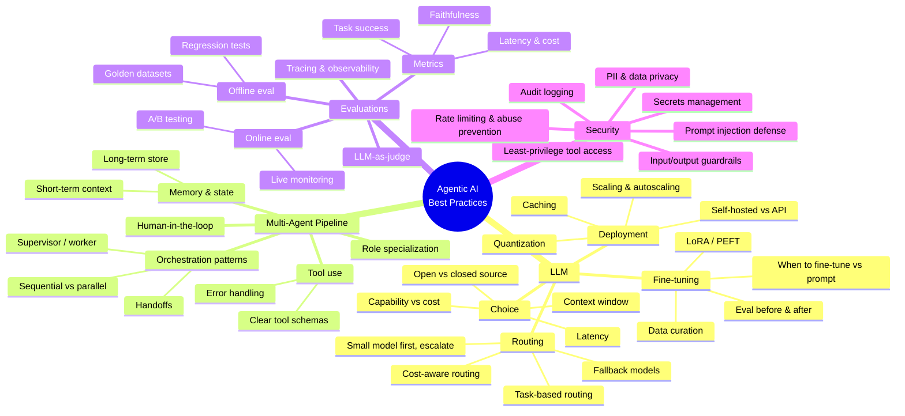

# Best Practices for Agentic AI

```mermaid
mindmap
  root((Agentic AI<br/>Best Practices))
    LLM
      Choice
        Capability vs cost
        Context window
        Latency
        Open vs closed source
      Deployment
        Self-hosted vs API
        Scaling & autoscaling
        Caching
        Quantization
      Routing
        Task-based routing
        Small model first, escalate
        Fallback models
        Cost-aware routing
      Fine-tuning
        When to fine-tune vs prompt
        Data curation
        LoRA / PEFT
        Eval before & after
    Multi-Agent Pipeline
      Orchestration patterns
        Supervisor / worker
        Sequential vs parallel
        Handoffs
      Role specialization
      Memory & state
        Short-term context
        Long-term store
      Tool use
        Clear tool schemas
        Error handling
      Human-in-the-loop
    Evaluations
      Offline eval
        Golden datasets
        Regression tests
      Online eval
        A/B testing
        Live monitoring
      LLM-as-judge
      Metrics
        Task success
        Faithfulness
        Latency & cost
      Tracing & observability
    Security
      Prompt injection defense
      Input/output guardrails
      Least-privilege tool access
      Secrets management
      PII & data privacy
      Audit logging
      Rate limiting & abuse prevention
```
